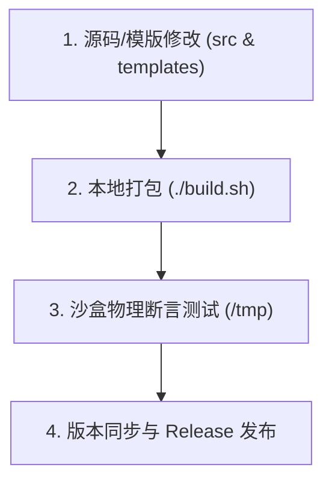

# 🛠️ Spec-Driven Solo 开发者与维护者贡献指南 (CONTRIBUTING)

欢迎加入 **Spec-Driven Solo** 的维护与演进！为了保证本脚手架的**单源真理（Single Source of Truth）、100% 物理目录树对齐**以及**跨平台零依赖发布**，所有维护者（包括人类贡献者与 AI 协同 Agent）必须严格遵守以下规范。

---

## ⚖️ 维护者最高三大铁律

1. **单源真理**：严禁直接手动修改 `release/init_spec.sh`！所有代码与逻辑变动必须修改 `src/cli.sh` 或 `templates/`，并通过 `./build.sh` 编译生成产物。
2. **100% 物理对齐**：任何物理目录或文件结构的变更，必须同步更新 `src/cli.sh`（渲染逻辑）、`templates/`（模版文件）以及 `README.md`（目录树说明）。
3. **卡点防线（No Assertion, No Release）**：任何 PR 或版本发布前，必须通过沙盒物理存在性断言测试（Physical Assertion Check）。

---

## 🔄 规范升级 4 步标准 SOP



### 1. 修改源码轨与模版轨

* **修改 AI 系统铁律**：编辑 `templates/rules/clinerules.md.tpl`。
* **修改 CLI 逻辑或交互**：编辑 `src/cli.sh`。
* **修改模版文件**：编辑 `templates/` 对应 Profile 目录下的内容。

### 2. 执行本地编译打包

在项目根目录运行：

```bash
./build.sh

```

*构建脚本会自动对 `templates/` 进行物理过滤、压缩并进行安全 Base64 编码，生成纯净的自包含单文件 `release/init_spec.sh`。*

### 3. 沙盒物理断言测试

在本地终端中运行以下测试命令，确保新打包的脚手架能够 100% 正确渲染目录树：

```bash
# 进入临时目录测试
cd /tmp && rm -rf test-spec-app
/路径/到/spec-driven-solo/release/init_spec.sh test-spec-app

# 执行 100% 物理存在性断言
cd test-spec-app
test -f .clinerules && \
test -f .codexrules && \
test -f .clineignore && \
test -f .gitignore && \
test -f package.json && \
test -f tsconfig.json && \
test -d product-assets/PRD && \
test -d product-assets/wireframes && \
test -f product-assets/research/tech-review.md && \
test -f memory-bank/projectBrief.md && \
test -f memory-bank/techContext.md && \
test -f memory-bank/systemPatterns.md && \
test -f memory-bank/dataModels.md && \
test -f memory-bank/activeContext.md && \
test -f memory-bank/progress.md && \
test -d memory-bank/archive && \
test -f src/types/index.ts && \
test -d src/components && \
test -d src/lib && \
test -f src/main.ts && \
echo "🎉 [ASSERTION PASSED]: 所有物理节点 100% 精准对齐！零遗漏，零偏差！"

```

### 4. 版本同步与 Git 发布

1. 同步更新 `README.md` 中的 Change Log 与 Quick Start 路径。
2. (可选) 在 GitHub 发起 Release 提案时，建议选用 .github/ISSUE_TEMPLATE/release_checklist.md 模板进行逐项走查打勾。
3. 运行发布命令：
```bash
git add .
git commit -m "chore: release vX.Y.Z"
git tag -a vX.Y.Z -m "Spec-Driven V X.Y.Z 正式发布"
git push origin main --tags

```
---

## 💬 维护者 AI 协同 Prompt

如果你在使用 AI 助手（ChatGPT / Claude / Cursor / Cline）协助演进本规范，请将以下 Prompt 复制给 AI：

你现在是 AI Coding 规范“Spec-Driven Solo”的资深元架构师 (Meta-Architect) 与核心维护者。
你了解本仓库采用的是“开发轨源码多模版解耦 + 编译期单文件打包 + 物理存在性断言”的元脚手架架构。

### 🎯 本次规范升级需求
[在此详细描述你的需求，例如：新增 Flutter 跨端移动端 Profile / 增加 Memory Bank 冷热数据自动归档逻辑]

### ⚖️ 维护者三大不可逾越铁律 (Hard Constraints)
1. 🛑 【单源真理禁区】：严禁直接修改或生成 `release/init_spec.sh`！一切 CLI 逻辑修改必须在 `src/cli.sh`，一切规则/模版修改必须在 `templates/`。产物必须由 `./build.sh` 编译生成。
2. 🔄 【全轨道物理对齐】：若本次改动涉及目录或文件结构的增减，你【必须】同时修改以下 3 处：
   - `templates/`：新增/修改对应的模版文件或占位符
   - `src/cli.sh`：更新 `mkdir/touch/render_template_file` 逻辑
   - `README.md`：同步更新 Repository Tree 物理目录树结构说明
3. 🧪 【物理断言交付卡点】：在修改完成后，你必须为我提供一段在 `/tmp` 沙盒中可直接全选运行的物理存在性断言 Bash 测试脚本（包含 `test -f` / `test -d`），确保初始化产物 100% 精准对齐。

### 📋 你的执行 SOP
1. **影响面分析 (Impact Analysis)**：先列出本次改动受影响的文件清单（包含 src/、templates/ 与 README.md）。
2. **源码修改 (Implementation)**：给出对 `src/cli.sh` 与 `templates/` 的具体修改方案。
3. **打包与测试引导 (Build & Assert)**：提示我运行 `./build.sh`，并输出包含全量物理节点的沙盒断言测试命令。

请首先进行影响面分析，确认理解后等待我的确认再输出代码！

---