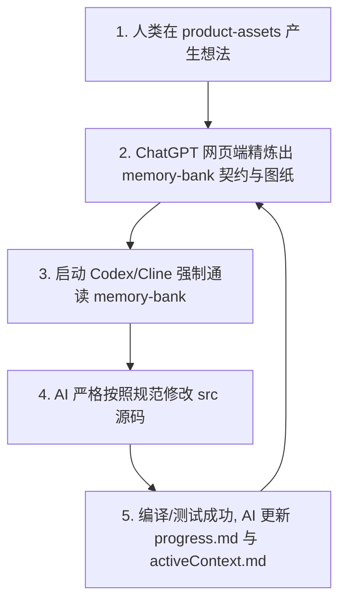

# 📘 Spec-Driven Solo 开发工程规范 (V1.0)

> **专为 ChatGPT Plus (Web) + Codex / Cline / Roo-Cline 架构设计的全栈三轨工程标准。用冰冷的工程法律约束混沌的 AI，彻底终结幻觉、失忆与 Token 燃烧死循环。**

---

## 💡 为什么需要 Spec-Driven Solo？

你是否也在独立开发中遭遇过以下背叛？
* ❌ **AI 瞎猜修复**：在终端运行编译或 Lint 报错后，Cline/Codex 开始“瞎猜修改 $\rightarrow$ 引入新报错 $\rightarrow$ 再次瞎猜”，陷入死循环直到耗尽你的 Token 或调用额度。
* ❌ **长对话失忆**：随着代码量增加，AI 的 Context 满溢，它开始忘记最初的产品愿景，甚至自作主张引入复杂黑名单库（如 Redux、Axios），导致项目架构崩溃。
* ❌ **无契约裸奔**：用口语化的自然语言让 AI 写代码，缺乏强类型数据契约，前后端或组件间接口漏洞百出。

**Spec-Driven Solo 是你的解药。** 
它是一套高度工程化的硬性目录架构与职责划分标准，通过将工程拆分为 **人类输入（资产轨）**、**AI 控制（记忆轨）**、**业务落地（源码轨）**，实现在 **$20/月固定成本** 的商业假设下，高并发、零死循环的独立全栈开发。

---

## 📂 一、 完整工程目录树 (Repository Tree)

本规范的核心在于严丝合缝的 **“三轨制”** 职责划分。通过本地常驻的系统规则，AI 将被迫遵循这套目录哲学：

```text
你的项目根目录/
├── 📄 .clinerules / .codexrules   # ⚖️ 【系统铁律】最高优先级 AI 行为紧箍咒（含强熔断机制）
│
├── 📂 product-assets/             # 🎨 【资产轨】人类初始想法与产品资产（AI 仅读，严禁高频扫描）
│   ├── 📂 PRD/                    # 原始需求文档、用户故事随笔、核心业务流
│   ├── 📂 wireframes/             # UI 截图、原型图说明、Figma/设计稿引用链接
│   └── 📂 research/               # 竞品调研、市场灵感、用户反馈记录
│
├── 📂 memory-bank/                # 🧠 【记忆轨】AI 外部持久化大脑（AI 高频读写，核心控制中枢）
│   ├── 📄 projectBrief.md         # 基础：产品愿景、核心范围、显式非目标（不做什么）
│   ├── 📄 techContext.md          # 依赖：锁死的技术栈、编译环境、严禁引入的黑名单库
│   ├── 📄 systemPatterns.md       # 架构：核心设计模式、目录哲学、UI 组件嵌套树
│   ├── 📄 dataModels.md           # 契约：TypeScript 强类型接口与 JSON Schema 定义
│   ├── 📄 activeContext.md        # 短期：当前执行的即时上下文、遇到的坎、采取的权宜之计
│   └── 📄 progress.md             # 状态：切香肠式可执行清单（Task Checklist: Todo/Doing/Done）
│
├── 📂 src/                        # 🛠️ 【源码轨】业务逻辑实现（AI 唯一的纯代码输出目标）
│   ├── 📂 types/                  # 强类型镜像（完全映射并引用 memory-bank/dataModels.md）
│   ├── 📂 components/             # 原子化前端 UI 组件（UI 纯组件与容器组件分离）
│   ├── 📂 lib/                    # 核心工具函数、数据库客户端、业务逻辑封装
│   └── 📄 main.ts / app.tsx       # 应用程序主入口
│
├── 📄 package.json                # 依赖管理清单
└── 📄 tsconfig.json               # 严格的 TypeScript 编译配置文件

```

---

## ⚖️ 二、 三轨制协作法理与最高铁律

### 1. 三轨各司其职

* **资产轨 (`product-assets/`)**：存放人类发散、口语化的原始想法。**AI 编码时严禁读取和高频扫描此目录**，防止污染上下文。
* **记忆轨 (`memory-bank/`)**：由 ChatGPT 网页端将上游原料精炼后的“高纯度工程图纸”。全部采用高度结构化的 Markdown 锁死技术边界与数据契约。
* **源码轨 (`src/`)**：AI 自动生成，人类 Diff 审计的唯一纯代码输出目标。

### 2. 行为紧箍咒与硬熔断机制

项目根目录下的 `.clinerules / .codexrules` 会在全局层面劫持 AI Agent 的系统提示词：

> 1. **开工先读脑**：每次对话开始前，必须完整通读 `memory-bank/` 下的所有文件，重建世界观。
> 2. **编码对契约**：严禁改动任何未在 `activeContext.md` 中提及的源码文件；编写业务逻辑前，必须严格对齐 `dataModels.md` 的强类型。
> 3. **💥 报错熔断机制**：一旦在终端运行编译、构建或 Lint 命令**连续失败超过 3 次**，AI 必须立刻停止（Stop）一切 Act 行为，向人类如实报告，**严禁盲目猜测修改**。
> 
> 

---

## 🔄 三、 标准工程运行闭环 (SOP)

目录固定后，你和你的 AI 智能体（Codex/Cline）将产生钢铁般的线性循环：



---

## 🚀 四、 3秒极速上手 (Quick Start)

你不需要手动创建这一堆繁琐的目录和规则文件。在 Mac / Linux 终端中，直接在你想创建项目的目录下运行以下命令，即可一键生成标准的 Spec-Driven 骨架：

```bash
curl -fsSL [https://raw.githubusercontent.com/soyona/spec-driven-solo/main/init_spec.sh](https://raw.githubusercontent.com/soyona/spec-driven-solo/main/init_spec.sh) | bash
```

### 自定义项目名称：
```bash
curl -fsSL [https://raw.githubusercontent.com/soyona/spec-driven-solo/main/init_spec.sh](https://raw.githubusercontent.com/soyona/spec-driven-solo/main/init_spec.sh) | bash -s my-cool-app
```
执行成功后，直接使用 VS Code 打开该目录，并将文件夹授权给 Codex/Cline，即可开启无情搬砖模式！

---

## 📘 五、 进阶指南

为了帮助你彻底掌握这套心法，项目 `docs/` 目录下准备了完整的操作圣经：

* [1-Spec-Driven Solo 开发工程规范 V1.0](https://github.com/soyona/spec-driven-solo/blob/main/docs/1-engineering-spec.md) ：深入理解三轨制的协作法理与目录哲学。
* [2-Spec-Driven Solo 新手入门指南 V1.0](https://github.com/soyona/spec-driven-solo/blob/main/docs/2-beginner-guide.md) ：手把手带你进行第一次“图纸压榨”与“人机协同 Review”，内含通关 Prompt 咒语。

---

## 📄 开源许可证

本项目基于 [MIT License](https://www.google.com/search?q=./LICENSE) 开源。欢迎所有超级个体自由地修改、分发并用于商业项目。

如果你觉得这套规范帮你省下了 Token 或拯救了发际线，请为本项目点一个 ⭐ **Star**，这也是对独立开发者最好的支持！