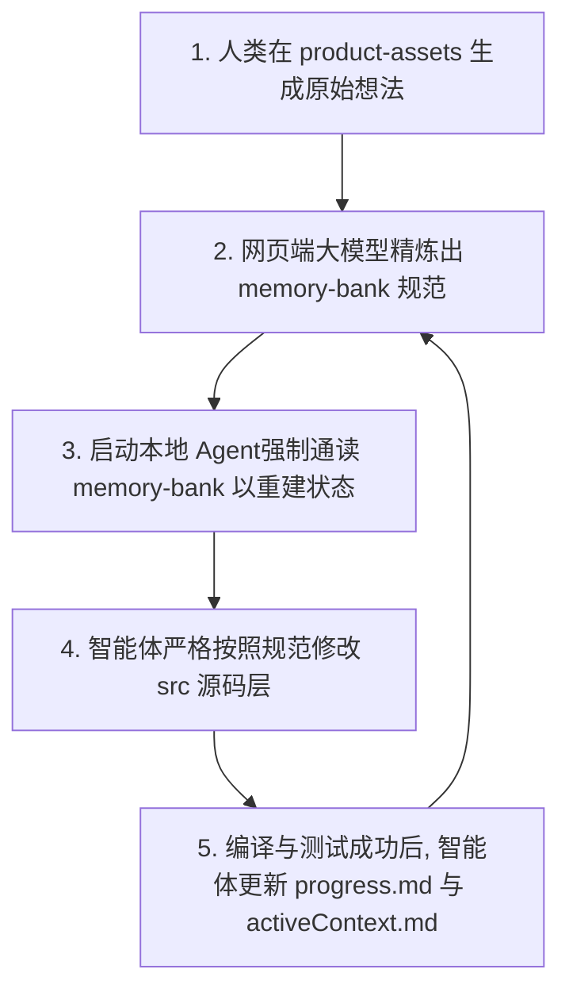

# 📘 Spec-Driven Solo 开发工程规范 (V2.0.0-Matrix)

> **专为 ChatGPT Plus (Web) + Codex / Cline / Roo-Cline 架构设计的矩阵化、多形态三轨工程标准。旨在通过动态注入特化技术轮廓（Tech Profile）与硬性宿主路由拦截，系统性解决自主 AI 编程智能体在长对话迭代中出现的幻觉、状态丢失、环境漂移以及无限执行死循环等核心痛点。**

---

## 💡 为什么需要 Spec-Driven Solo？

### 从“人际协作”到“人机共生”的范式重构
在传统软件工程（如 Scrum、Agile）中，研发流程的底层设计主要用于解决**人与人之间的协作、分工和信任成本**，其核心瓶颈在于“人类团队的编码带宽”。

然而，在 **Solo（超级个体）+ AI 智能体** 的新开发范式下，生产力带宽已被十倍级放大，传统流程彻底失效。这一范式转变带来了全新的工程核心矛盾：**人机通信的精确度、状态同步的无序性，以及如何用确定性的代码规范去约束混沌的 AI 行为**。

若直接将传统研发习惯沿用至 AI 协同流水线中，将不可避免地遭遇以下由 Agent 机制缺陷导致的系统性工程痛点：

* **❌ 无约束异常修复（Token 异常消耗）**：在终端运行编译或 Lint 报错后，智能体容易进入“盲目修改 $\rightarrow$ 引入新错 $\rightarrow$ 再次盲目修改”的递归尝试中。这种缺乏根因验证的高频试错，极易陷入死循环，导致上下文窗口与 Token 额度异常消耗。
* **❌ 上下文窗口饱和（历史状态丢失）**：随着代码库规模线性增长，超出上下文窗口限制会导致历史状态丢失。智能体将失去对全局代码库的宏观认知，引发偏离初始产品愿景、重复编写已有逻辑、或引入未授权第三方冗余依赖等问题。
* **❌ 隐式契约脱节（重构与集成缺陷）**：过于依赖自然语言口语化输入，缺乏结构化、确定性的强类型契约支撑。当前后端或组件边界发生重构时，智能体无法自动感知变更边界，极易引入隐性回归缺陷。

关于独立开发中“AI 智能体引入的新痛点与研发范式演进”的深度剖析，可详细参考 [Solo Dev Problem 痛点定义文档](https://github.com/soyona/sadp/blob/main/v2/0-Solo%20Dev%20Problem.md)[cite: 9]。

**Spec-Driven Solo** 正是为了响应这一范式代际转变而生。它摒弃了以自然语言低效指挥 Agent 的传统做法，通过建立严格的目录层级隔离，将工程划分为 **产品资产（资产轨）**、**状态控制（记忆轨）** 与 **功能落地（源码轨）**，为 Solo 开发者量身定制了一套确保软件协同构建过程高效、可预测与可验证的底层操作系统。


### 理论根基与行业演进坐标

本框架的设计基于两项核心软件工程理论：

1. **规范驱动软件合成 (Specification-Driven Software Synthesis)**：传统的自然语言 Prompt 具有极高的模糊性与语义熵。本规范通过引入前置、确定性的数据与行为规约，将 Agent 的自然语言生成问题（Generation）转化为基于严格约束的软件合成问题，从根本上降低了幻觉的发生概率。
2. **非瞬时状态外部化 (Externalized State Tracking)**：智能体在长对话中表现出的“健忘”本质上是有限上下文内的马尔可夫决策过程（MDP）失效。本规范参考了经典控制理论中的状态机设计，将智能体的运行状态与架构认知解耦并常驻于本地磁盘，实现跨会话的记忆持久化。

在当前的 AI Coding 行业演进浪潮中，本规范与全球主流的技术演进路径保持高度一致：

* **对齐行业标准架构**：本框架的“三轨隔离”与核心系统指令，在设计哲学上深度契合了 Anthropic 推出的 **Model Context Protocol (MCP)** 开放标准，即通过标准化上下文协议，切断智能体与不可控原始数据的直接接触。
* **演进自工业界最佳实践**：本框架的记忆银行（Memory Bank）设计，吸收并优化了 Cline、Roo-Cline 以及主流 Agent 开源社区中自发演进出的常驻知识库范式。相较于完全交由 Agent 自主维护的传统做法，本规范强调了“人机协同走查（Human-in-the-loop Review）”，确保图纸在输入源码轨前具备绝对的确定性。

---

## 📂 一、 完整工程目录树 (Repository Tree)

本规范强制执行以下目录结构。智能体将通过常驻的行为准则，被严格约束在此套目录哲学之内：

```text
你的项目根目录/
├── 📄 .clinerules / .codexrules   # ⚖️ 【系统铁律】最高优先级 AI 行为紧箍咒（含强熔断机制）
│
├── 📂 product-assets/             # 🎨 【资产轨】人类初始想法与产品资产（AI 仅读，严禁高频扫描）
│   ├── 📂 PRD/                    # 原始需求文档、用户故事随笔、核心业务流
│   ├── 📂 wireframes/             # UI 截图、原型图说明、Figma/设计稿引用链接
│   └── 📂 research/               # 竞品调研、市场灵感、用户反馈记录
│
├── 📂 memory-bank/                # 🧠 【记忆轨】AI 外部持久化大脑（AI 高频读写，核心控制中枢）
│   ├── 📄 projectBrief.md         # 基础：产品愿景、核心范围、显式非目标（不做什么）
│   ├── 📄 techContext.md          # 依赖：锁死的技术栈、编译环境、严禁引入的黑名单库
│   ├── 📄 systemPatterns.md       # 架构：核心设计模式、目录哲学、UI 组件嵌套树
│   ├── 📄 dataModels.md           # 契约：TypeScript 强类型接口与 JSON Schema 定义
│   ├── 📄 activeContext.md        # 短期：当前执行的即时上下文、遇到的坎、采取的权宜之计
│   └── 📄 progress.md             # 状态：切香肠式可执行清单（Task Checklist: Todo/Doing/Done）
│
├── 📂 src/                        # 🛠️ 【源码轨】业务逻辑实现（AI 唯一的纯代码输出目标）
│   ├── 📂 types/                  # 强类型镜像（完全映射并引用 memory-bank/dataModels.md）
│   ├── 📂 components/             # 原子化前端 UI 组件（UI 纯组件与容器组件分离）
│   ├── 📂 lib/                    # 核心工具函数、数据库客户端、业务逻辑封装
│   └── 📄 main.ts / app.tsx       # 应用程序主入口
│
├── 📄 package.json                # 依赖管理清单
└── 📄 tsconfig.json               # 严格的 TypeScript 编译配置文件

```

---

## ⚖️ 二、 三轨制协作法理与最高铁律

### 1. 轨道职责隔离

* **资产轨 (`product-assets/`)**：存放未精炼的人类原始口语化需求。智能体在编码阶段严禁高频扫描此目录，以防止污染上下文空间。
* **记忆轨 (`memory-bank/`)**：由网页端将上游原料精炼后的标准工程图纸。所有文件采用高度结构化的 Markdown 格式，用以锁死技术边界与数据契约。
* **源码轨 (`src/`)**：智能体自动生成的唯一纯代码输出目标，由人类开发者实施差分审计（Diff Audit）。

### 2. 行为准则与硬熔断协议

项目根目录下的 `.clinerules / .codexrules` 会在全局层面劫持 AI Agent 的系统提示词：

> 0. **矩阵型开工依赖检查**：每次会话开始前，必须物理检查 memory-bank/ 下的 projectBrief.md 与 dataModels.md 是否已被人类通过所选的技术轮廓成功初始化。如果文件为空或仅包含模板说明，你必须立刻停止（Stop）一切 Act 行为，强制熔断并报警！
> 1. **状态同步**：每次对话开始前，必须完整通读 `memory-bank/` 下的所有文件，重建对代码库的全局认知。
> 2. **契约对齐**：严禁改动任何未在 `activeContext.md` 中提及的源码文件[cite: 9]；编写业务逻辑前，必须严格对齐 `dataModels.md` 的强类型[cite: 9]。
> 3. **💥 3次异常熔断线**：在终端运行检查、编译或测试命令时，一旦**连续失败超过 3 次**，必须立刻停止（Stop）一切 Act 行为，向人类如实报告原始日志并挂起会话。**严禁盲目猜测修改**。
> 4. **⚙️ 记忆回写即交付 (No Log, No Done)**：你在声称任何任务“修复完成”或“请求验收”前，【必须且只能】将物理更新 `memory-bank/activeContext.md` 与 `memory-bank/progress.md` 作为你 Act 行为的最后一步。若仅修改源码而未同步外部化状态（EST），则判定为【非法交付】，系统将拒绝承认并原地锁定。
> 5. **🌐 运行环境双轨验证**：除通过 Lint 和 Build 静态三层卡点外，若涉及局域网（192.168.x.x）或物理真机调试，必须在前置配置轨中显式允许安全源（如 Next.js 的 allowedDevOrigins），严禁产生隐式运行时跨域死锁。
> 6. **🛠️ 宿主编译与形态特化防线**：智能体必须遵循当前激活的形态开展针对性编译。例如：
> * **微信小程序 (Taro)**：本地构建体积若超过 2MB 物理极限，必须触发硬熔断提示分包。
> * **跨平台桌面端 (Tauri)**：智能体必须同时监控前后端编译器（cargo check），且 Rust 侧严禁出现任何未经捕获的 panic! 恐慌。
> * **复杂数据后台 (Next.js)**：严格监控组件依赖项，预防由数据级高频局部订阅导致的服务端/前端无效高频重渲染死循环。

---

## 🔄 三、 标准工程运行闭环 (SOP)

系统的交互模型遵循线性循环生命周期：



---

## 🚀 四、 3秒极速上手 (Quick Start)

你无需手动创建这一堆繁琐的目录和规则文件。在 Mac / Linux 终端中，直接在你想创建项目的目录下运行以下命令，即可一键生成带有强交付卡点与环境验证的标准的 **Spec-Driven V2.0.0-Matrix** 骨架：

```bash
curl -fsSL https://raw.githubusercontent.com/soyona/spec-driven-solo/main/init_spec.sh | bash
```

### 自定义项目名称：
```bash
curl -fsSL https://raw.githubusercontent.com/soyona/spec-driven-solo/main/init_spec.sh | bash -s my-cool-app
```


### 🎨 交互式技术轮廓激活：

运行脚本后，终端将强制挂起并弹出**矩阵交互选择菜单**。你可以根据当前的产品形态，一键锁死对应的工程防线：

* `[1]` **Web/SaaS 轻量通用型** (Vite + React + TS + Tailwind) `[默认]`
* `[2]` **微信跨端小程序** (Taro 4.x + React + TS)
* `[3]` **跨平台桌面端应用** (Tauri 2.x + React + Rust)
* `[4]` **复杂数据/BI 后台管理** (Next.js + Zustand + Shadcn/ui)

执行完毕后，使用集成开发环境（IDE）打开该目录，并将工作区访问权限授予您的 Codex / Cline / Roo-Cline 智能体。本脚手架已在根目录默认内置 `.clinerules`，智能体连接后将自动读取并被硬性约束。

---

## 📘 五、 进阶指南

为了更深入地理解底层设计模式与工作流自动化，请参阅随附 docs/ 的技术指南：

* [1-Spec-Driven Solo 开发工程规范 V1.0](https://github.com/soyona/spec-driven-solo/blob/main/docs/1-engineering-spec.md) ：深入理解三轨制的协作法理与目录哲学。
* [2-Spec-Driven Solo 新手入门指南 V1.0](https://github.com/soyona/spec-driven-solo/blob/main/docs/2-beginner-guide.md) ：手把手带你进行第一次“图纸压榨”与“人机协同 Review”，内含通关 Prompt 咒语。

---


## 📅 变更日志 (Change Log)

### [V2.0.0-Matrix] - 2026-07-09

* **🚀 新增特性**：**全形态技术轮廓 (Tech Profile) 矩阵化分流系统**。
* **工程根因**：原 V1.x 版本采用单一 Web 状态机和一刀切的编译黑名单规则，无法适应 Solo 开发者在多端（如跨端微信小程序、Tauri 桌面端沙盒隔离、Next.js 混合架构）下的异构编译卡点，导致 AI 频繁在小程序上安装原生 UI 库、或在桌面端写出让 Rust 恐慌（`panic!`）的越权脚本。
* **优化目的**：引入交互式脚手架初始化菜单，将状态拓扑层（如特许解禁低熵 Zustand、或是强制锁死 React Context）、宿主路由拦截命令及负向约束，根据人类选择的形态，**精准向下一体化投影**至物理规则文件（`.clinerules` 及 `techContext.md`）中，形成全形态的确定性防线。
* **体验补丁**：完美修复了 Bash 文本插值中关于 Heredoc 内部反引号与路径转义不一致引起的词法高亮撕裂问题。


### [V1.3.0] - 2026-07-09
* **🚀 新增特性**：固化资产轨输入底线与智能体前置依赖防呆熔断。

### [V1.2.0] - 2026-07-06

* **🚀 新增特性**：引入“双向握手”与“运行环境双轨验证”机制。

### [V1.1.0] - 2026-07-05

* **🚀 新增特性**：项目初始化时默认自动构建 `.gitignore` 配置文件。

---

## 🚀 官方实战案例研究 (Case Study)

### 🏷️ 标杆项目：Hanzi Connect (汉字连连看)

为了完整验证规范在真实复杂前端应用中的可靠性，本规范正式引入 **[hanzi-connect](https://www.google.com/search?q=https://github.com/soyona/hanzi-connect)** 作为官方标准落地项目。

该项目是一个专门面向低年级儿童识字教学设计的去后端、纯静态、高性能 React + TypeScript 连连看游戏。在不借助任何后端和复杂本地持久化库的前提下，全流程严格基于本规范的 **Memory Bank (记忆银行)** 机制进行单兵敏捷迭代，完美展示了如何利用“图纸契约”驱动 AI 实现高确定性、零瞎猜、零死锁的代码演进。

得益于本规范严格的“改码前先改图纸”的宪法约束，项目在整个高频敏捷开发过程中，**生产环境编译检查（`npm run build`）始终保持 100% 一次性绿灯通过**，彻底杜绝了 AI 绝大多数的“胡乱写代码”和“堆砌无用冗余逻辑”的通病。

---

## 📄 开源许可证

本项目基于 [MIT License](https://www.google.com/search?q=https://github.com/soyona/spec-driven-solo/blob/main/LICENSE) 开源。欢迎所有超级个体自由地修改、分发并用于商业项目。

```

```