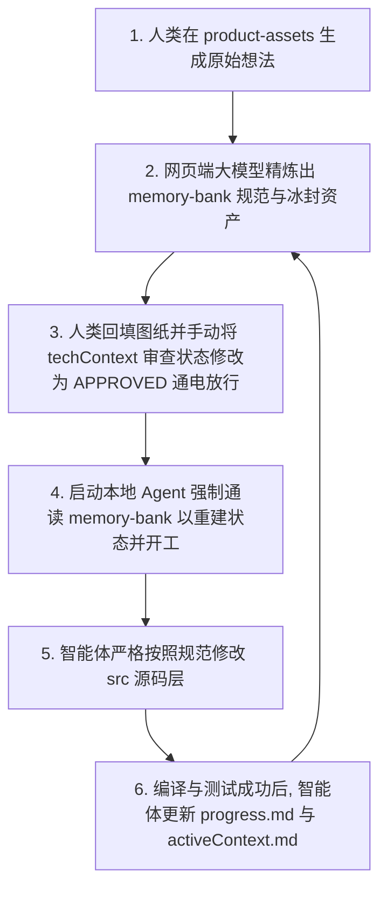

> **当前规范版本**：`v2.4.0` | 完整演进记录请参阅 [变更日志](#-变更日志-change-log)。
# 📘 Spec-Driven Solo 开发工程规范

> **专为 ChatGPT Plus (Web) + Codex 架构设计的矩阵化、多形态三轨工程标准。旨在通过 Codex 项目规则、精确读取预算以及动态记忆体冷热轮转规约，系统性解决自主 AI 编程智能体在长对话迭代中出现的幻觉、Token 侧漏、上下文饱和、历史状态丢失以及盲目重试死循环等核心痛点。**

---

## 💡 为什么需要 Spec-Driven Solo？

### 从“人际协作”到“人机共生”的范式重构
在传统软件工程（如 Scrum、Agile）中，研发流程的底层设计主要用于解决**人与人之间的协作、分工和信任成本**，其核心瓶颈在于“人类团队的编码带宽”。

然而，在 **Solo（超级个体）+ AI 智能体** 的新开发范式下，生产力带宽已被十倍级放大，传统流程彻底失效。这一范式转变带来了全新的工程核心矛盾：**人机通信的精确度、状态同步的无序性，以及如何用确定性的代码规范去约束混沌的 AI 行为**。

若直接将传统研发习惯沿用至 AI 协同流水线中，将不可避免地遭遇以下由 Agent 机制缺陷导致的系统性工程痛点：

* **❌ 无约束异常修复（Token 异常消耗）**：在终端运行编译或 Lint 报错后，智能体容易进入“盲目修改 -> 引入新错 -> 再次盲目修改”的递归尝试中。这种缺乏根因验证的高频试错，极易陷入死循环，导致上下文窗口与 Token 额度异常消耗。
* **❌ 高频重复读取与全局盲搜（只读内耗）**：智能体在面对未知错误时，往往倾向于无脑重复读取长篇幅的记忆文件（如 activeContext）或在全量源码树中执行无路径限制的模糊检索（如全局 `rg`），导致有价值的上下文被瞬间冲刷，引发严重的 Token 财务灾难。
* **❌ 上下文窗口饱和（历史状态丢失）**：随着代码库规模线性增长，超出上下文窗口限制会导致历史状态丢失。智能体将失去对全局代码库的宏观认知，引发偏离初始产品愿景、重复编写已有逻辑、或引入未授权第三方冗余依赖等问题。
* **❌ 隐式契约脱节（重构与集成缺陷）**：过于依赖自然语言口语化输入，缺乏结构化、确定性的强类型契约支撑。当前后端或组件边界发生重构时，智能体无法自动感知变更边界，极易引入隐性回归缺陷。

关于独立开发中“AI 智能体引入的新痛点与研发范式演进”的深度剖析，可详细参考 [Solo Dev Problem 痛点定义文档](https://github.com/soyona/sadp/blob/main/v2/0-Solo%20Dev%20Problem.md)[cite: 9]。

**Spec-Driven Solo** 正是为了响应这一范式代际转变而生。它摒弃了以自然语言低效指挥 Agent 的传统做法，通过建立严格的目录层级隔离，将工程划分为 **产品资产（资产轨）**、**状态控制（记忆轨）** 与 **功能落地（源码轨）**，为 Solo 开发者量身定制了一套确保软件协同构建过程高效、可预测与可验证的底层操作系统。


### 理论根基与行业演进坐标

本框架的设计基于三项核心软件工程理论：

1. **规范驱动软件合成 (Specification-Driven Software Synthesis)**：传统的自然语言 Prompt 具有极高的模糊性与语义熵。本规范通过引入前置、确定性的数据与行为规约，将 Agent 的自然语言生成问题（Generation）转化为基于严格约束的软件合成问题，从根本上降低了幻觉的发生概率。
2. **非瞬时状态外部化 (Externalized State Tracking)**：智能体在长对话中表现出的“健忘”本质上是有限上下文内的马尔可夫决策过程（MDP）失效。本规范参考了经典控制理论中的状态机设计，将智能体的运行状态与架构认知解耦并常驻于本地磁盘，实现跨会话的记忆持久化。
3. **冷热资产数据脱水 (Data Dehydration & Cold Archives)**：基于智能体盲目贪婪读取的本能，通过目录职责与 Codex 读取规则，将历史沉淀资产与高频执行上下文实施拆分，减少长周期会话中的 Token 侧漏。


在当前的 AI Coding 行业演进浪潮中，本规范与全球主流的技术演进路径保持高度一致：

* **对齐行业标准架构**：本框架的“三轨隔离”与核心系统指令，在设计哲学上深度契合了 Anthropic 推出的 **Model Context Protocol (MCP)** 开放标准，即通过标准化上下文协议，切断智能体与不可控原始数据的直接接触。
* **演进自工业界最佳实践**：本框架的记忆银行（Memory Bank）设计，吸收并优化了主流 Agent 开源社区中自发演进出的常驻知识库范式。相较于完全交由 Agent 自主维护的传统做法，本规范强调了“人机协同走查（Human-in-the-loop Review）”，确保图纸在输入源码轨前具备绝对的确定性。

---

## 📂 一、 完整工程目录树 (Repository Tree)

本规范强制执行以下目录结构。智能体将通过常驻的行为准则，被严格约束在此套目录哲学之内：

```text
你的项目根目录/
├── 📄 AGENTS.md                   # 🤖 Codex 自动发现入口（引导读取 .codexrules）
├── 📄 .codexrules                 # ⚖️ Codex 项目规则唯一来源
│
├── 📂 product-assets/             # 🎨 【资产轨】人类初始想法与产品资产（AI 仅读，严禁高频扫描）
│   ├── 📂 PRD/                    # 原始需求文档、用户故事随笔、核心业务流
│   ├── 📂 wireframes/             # UI 截图、原型图说明、Figma/设计稿引用链接
│   └── 📂 research/               # 竞品调研、市场灵感、用户反馈记录
│       └── 📄 tech-review.md      # ❄️ 【V2.1.0 冰封资产】红队论证与底层技术选型结论
│
├── 📂 memory-bank/                # 🧠 【记忆轨】AI 外部持久化大脑（按任务读写，核心控制中枢）
│   ├── 📄 projectBrief.md         # 基础：产品愿景、核心范围、显式非目标（不做什么）
│   ├── 📄 techContext.md          # 依赖：锁死的技术栈、编译环境、严禁引入的黑名单库
│   ├── 📄 systemPatterns.md       # 架构：核心设计模式、目录哲学、UI 组件嵌套树
│   ├── 📄 dataModels.md           # 契约：TypeScript 强类型接口与 JSON Schema 定义
│   ├── 📄 activeContext.md        # 短期：当前执行的即时上下文、遇到的坎、采取的权宜之计
│   └── 📄 progress.md             # 状态：切香肠式可执行清单（Task Checklist: Todo/Doing/Done）
│   └── 📂 archive/                # 📂 【冷冻归档区】存放已脱水的历史记忆片断（Agent 严禁访问）
│
├── 📂 src/                        # 🛠️ 【源码轨】业务逻辑实现（主要代码输出目标）
│   ├── 📂 types/                  # 强类型镜像（完全映射并引用 memory-bank/dataModels.md）
│   ├── 📂 components/             # 原子化前端 UI 组件（UI 纯组件与容器组件分离）
│   ├── 📂 lib/                    # 核心工具函数、数据库客户端、业务逻辑封装
│   └── 📄 main.ts / app.tsx       # 应用程序主入口
│
├── 📄 package.json                # 依赖管理清单
└── 📄 tsconfig.json               # 严格的 TypeScript 编译配置文件
├── 📄 CONTRIBUTING.md           # 📖 【主文档】维护者工程规范、SOP 与升级铁律
└── 📂 .github/
    └── 📂 ISSUE_TEMPLATE/       # 📄 【自动化】版本升级与 Feature 提案模板
        └── 📄 release_checklist.md

```

---

## ⚖️ 二、 三轨制协作法理与最高铁律

### 1. 轨道职责隔离与核心契约

#### 🎨 资产轨 (`product-assets/`)
* **主体职责**：人类。存放所有发散、口语化、未经过提炼的产品和设计资产及云端论证结论（如 `PRD/`、`wireframes/`、`research/tech-review.md`）。
* **控制机制**：**AI 编码阶段严禁高频扫描或只读检索此目录**。它只是 `memory-bank/` 的上游原料库。当你有新想法或新原型图时，尽管扔进这里，绝对不会干扰当前正在编写的代码分支。

#### 🧠 记忆轨 (`memory-bank/`)
* **主体职责**：AI 读写、人类质检。由 ChatGPT 网页端将“资产轨”上游原料翻译并精炼后的“高纯度工程图纸”。所有文件采用高度结构化的 Markdown 格式，用以锁死技术边界与数据契约。
* **核心文件契约**：
  * `projectBrief.md`（**划定边界**）：明确写出“非目标（Out of Scope）”，一旦 AI 试图写出超出边界的功能，系统会自动提示违规。
  * `techContext.md`（**技术锁死与审查通电**）：声明编译命令，锁死技术栈并声明“黑名单库”（如：禁止自作主张安装 Redux 或 Axios）。顶部包含人类审查状态（`PENDING` / `APPROVED`），未经人类批准时本地 Agent 强制熔断挂起。
  * `dataModels.md`（**契约补丁**）：不准用自然语言描述数据，**必须直接使用标准的 TypeScript Interface 锁死所有核心数据结构**。它是前后端交互的最高法律。
  * `activeContext.md`（**防失忆与轮转瘦身**）：记录即时上下文、技术债与阻碍（Blocker）。物理行数超过 150 行时自动触发物理脱水，冷冻切片归档至 `memory-bank/archive/`。
  * `progress.md`（**进度锚点**）：切香肠式 `[ ]` 与 `[x]` 可执行清单。AI 每成功编译一个特性，必须在此文件中打勾；已完成任务超 20 项触发冷冻归档。
  * `archive/`（**冷归档区**）：存放已脱水的历史看板与上下文；`.codexrules` 规定 Codex 默认不得扫描读取。

#### 🛠️ 源码轨 (`src/`)
* **主体职责**：AI 实现、人类 Diff 审计。`src/` 是主要业务代码输出目标；任务需要时也允许修改测试、配置、脚本和文档。
* **类型对齐要求**：`src/types/` 必须作为强类型镜像，完全映射并引用 `memory-bank/dataModels.md` 中的强类型契约。

### 2. 行为准则与硬熔断协议

`AGENTS.md` 是 Codex 自动发现入口，要求 Codex 在开工前完整读取 `.codexrules`；`.codexrules` 是生成项目唯一的仓库级 AI 开发规则源，统一定义：

1. 分析、诊断和修改任务的授权边界；
2. 按任务加载 Memory Bank 的读取路由；
3. `PENDING / APPROVED` 架构审批门禁；
4. 目录职责、用户修改保护、依赖与安全边界；
5. 精确检索、失败处理和验证证据边界；
6. Memory Bank 回写条件与完成交付标准。

完整规则以初始化项目中的 `.codexrules` 为准，README 不复制规则全文，避免多源漂移。

---

## 🔄 三、 标准工程运行闭环 (SOP)

系统的交互模型遵循线性循环生命周期：


```mermaid
graph TD
    A[1. 人类在 product-assets 生成原始想法] --> B[2. 网页端大模型精炼出 memory-bank 规范与冰封资产]
    B --> C[3. 人类回填图纸并手动将 techContext 审查状态修改为 APPROVED 通电放行]
    C --> D[4. 启动本地 Agent 强制通读 memory-bank 以重建状态并开工]
    D --> E[5. 智能体严格按照规范修改 src 源码层]
    E --> F[6. 编译与测试成功后, 智能体更新 progress.md 与 activeContext.md]
    F --> B

```

---

## 🚀 四、 3秒极速上手 (Quick Start)

你无需手动创建这一堆繁琐的目录和规则文件。在 Mac / Linux 终端中，直接在你想创建项目的目录下运行以下命令，即可一键生成带有强交付卡点与环境验证的标准的 **Spec-Driven** 骨架：

```bash
curl -fsSL https://raw.githubusercontent.com/soyona/spec-driven-solo/main/release/init_spec.sh | bash
```

### 自定义项目名称：
```bash
curl -fsSL https://raw.githubusercontent.com/soyona/spec-driven-solo/main/release/init_spec.sh | bash -s my-cool-app
```


### 🎨 交互式技术轮廓激活：

运行脚本后，终端将强制挂起并弹出**矩阵交互选择菜单**。你可以根据当前的产品形态，一键锁死对应的工程防线：

* `[1]` **Web/SaaS 轻量通用型** (Vite + React + TS + Tailwind) `[默认]`
* `[2]` **微信跨端小程序** (Taro 4.x + React + TS)
* `[3]` **跨平台桌面端应用** (Tauri 2.x + React + Rust)
* `[4]` **复杂数据/BI 后台管理** (Next.js + Zustand + Shadcn/ui)

执行完毕后，使用集成开发环境（IDE）打开该目录，并将工作区访问权限授予 Codex。本脚手架在根目录生成 `AGENTS.md` 和 `.codexrules`：Codex 自动发现 `AGENTS.md`，再按入口说明加载完整项目规则。

---

## 📘 五、 进阶指南

为了更深入地理解底层设计模式与工作流自动化，请参阅随附 docs/ 的技术指南：

* [Spec-Driven Solo 新手入门指南](https://github.com/soyona/spec-driven-solo/blob/main/docs/beginner-guide.md) ：手把手带你进行第一次“图纸压榨”与“人机协同 Review”，内含通关 Prompt 与不断层逃逸格式。

---


## 📅 变更日志 (Change Log)
### [v2.4.0] - 2026-08-02
* 初始化项目仅面向 Codex，生成 `AGENTS.md` 与 `.codexrules`，移除 Cline 规则及忽略文件。
* `.codexrules` 成为唯一项目规则源，并补充授权、读取、审批、验证和 Memory Bank 回写边界。

### [V2.3.5-release.sh] - 2026-07-24
* **单源真理（Single Source of Truth, SSOT），取消版本号**.
### [V2.3.2-release.sh] - 2026-07-24
* **增加release.sh脚本一键发布**.
### [V2.3.0-Physical-Align] - 2026-07-24
* **🚀 正式发布：单文件发布架构归一化与目录清理**。
* **优化目的**：
  1. 遵循单源真理原则，物理删除根目录 `init_spec.sh`，统一收口至 `release/init_spec.sh`。
  2. 全量对齐文档、模版与 CLI 脚本的版本标记至 `v2.3.0`。

### [V2.2.0-Kernel-Rotator] - 2026-07-18
* **🚀 新增特性：集成物理隔离盲区 (`.clineignore`) 与动态记忆体轮转规约 (`Memory Rotation`)**。
* **工程根因**：解决项目在中后期迭代时，记忆文件体量恶性膨胀，导致本地 Agent 陷入“盲目通读”与“高频重复检索”的内耗陷阱，造成极高的 Token 浪费与历史状态冲刷。
* **优化目的**：
1. 增加底层 `memory-bank/archive/` 物理归档冷区，配合 `.clineignore` 强制智能体对已打勾的历史看板和过期技术债实施**物理脱水**，禁止扫描读取。
2. 确立“防重复读取锁”，单会话内同一记忆文件读取超 2 次直接强熔断，逼迫其使用上下文缓存，斩断内耗链条。

### [V2.1.0-Kernel] - 2026-07-11
* **🚀 新增特性：云端/本地双脑“冰封物理资产”与“人类主权通电开关”**。
* **工程根因**：解决在大段技术规格审计或历史选型论证中，本地 Agent 频繁扫描无用静态文本，导致上下文快速饱和及 Token 账单暴涨的问题。
* **优化目的**：
    1. 将技术可行性研究、架构选型结论从 techContext.md 中物理剥离，隔离至 product-assets/research/tech-review.md 中冷冻。
    2. 强制在 techContext.md 顶端引入 人类审查状态: PENDING / APPROVED。本地 Agent 面对空项目、未审查项目直接进入防呆熔断。只有人类将其手动改为 APPROVED 才能全面通电放行。

### [V2.0.0-Matrix] - 2026-07-09
* **🚀 新增特性**：**全形态技术轮廓 (Tech Profile) 矩阵化分流系统**。
* **工程根因**：原 V1.x 版本采用单一 Web 状态机和一刀切的编译黑名单规则，无法适应 Solo 开发者在多端（如跨端微信小程序、Tauri 桌面端沙盒隔离、Next.js 混合架构）下的异构编译卡点，导致 AI 频繁在小程序上安装原生 UI 库、或在桌面端写出让 Rust 恐慌（`panic!`）的越权脚本。
* **优化目的**：引入交互式脚手架初始化菜单，将状态拓扑层（如特许解禁低熵 Zustand、或是强制锁死 React Context）、宿主路由拦截命令及负向约束，根据人类选择的形态，**精准向下一体化投影**至物理规则文件（`.clinerules` 及 `techContext.md`）中，形成全形态的确定性防线。
* **体验补丁**：完美修复了 Bash 文本插值中关于 Heredoc 内部反引号与路径转义不一致引起的词法高亮撕裂问题。


### [V1.3.0] - 2026-07-09
* **🚀 新增特性**：固化资产轨输入底线与智能体前置依赖防呆熔断。

### [V1.2.0] - 2026-07-06

* **🚀 新增特性**：引入“双向握手”与“运行环境双轨验证”机制。

### [V1.1.0] - 2026-07-05

* **🚀 新增特性**：项目初始化时默认自动构建 `.gitignore` 配置文件。

---

## 🚀 官方实战案例研究 (Case Study)

### 🏷️ 标杆项目：Hanzi Connect (汉字连连看)

为了完整验证规范在真实复杂前端应用中的可靠性，本规范正式引入 **[hanzi-connect](https://www.google.com/search?q=https://github.com/soyona/hanzi-connect)** 作为官方标准落地项目。

该项目是一个专门面向低年级儿童识字教学设计的去后端、纯静态、高性能 React + TypeScript 连连看游戏。在不借助任何后端和复杂本地持久化库的前提下，全流程严格基于本规范的 **Memory Bank (记忆银行)** 机制进行单兵敏捷迭代，完美展示了如何利用“图纸契约”驱动 AI 实现高确定性、零瞎猜、零死锁的代码演进。

得益于本规范严格的“改码前先改图纸”的宪法约束，项目在整个高频敏捷开发过程中，**生产环境编译检查（`npm run build`）始终保持 100% 一次性绿灯通过**，彻底杜绝了 AI 绝大多数的“胡乱写代码”和“堆砌无用冗余逻辑”的通病。

---

## 📄 开源许可证

本项目基于 [MIT License](https://www.google.com/search?q=https://github.com/soyona/spec-driven-solo/blob/main/LICENSE) 开源。欢迎所有超级个体自由地修改、分发并用于商业项目。

---

## 🛠️ 规范贡献与维护

如果您希望参与 **Spec-Driven Solo** 规范的维护、新增技术轮廓（Tech Profile）或提交改进提案，请参阅我们的 [CONTRIBUTING.md](./CONTRIBUTING.md) 了解维护者 SOP 与打包断言规范。
