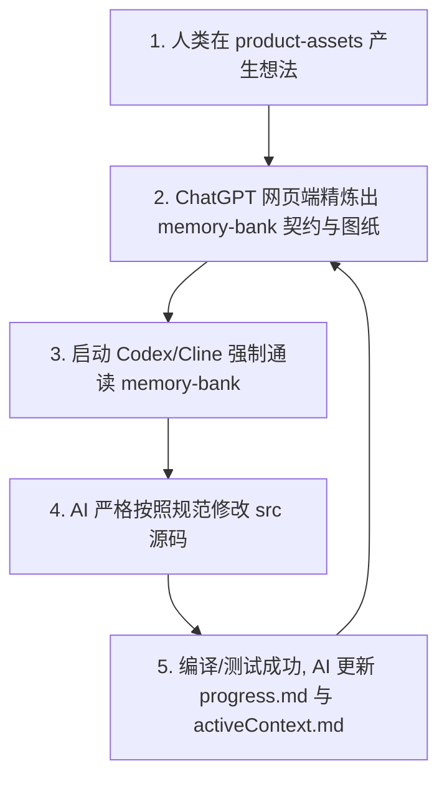

# 📘 Spec-Driven Solo 开发工程规范 (V1.0)

**—— 专为 ChatGPT Plus + Codex / Cline 架构设计的全栈三轨工程标准**

本规范是一套高度工程化的硬性目录架构与职责划分标准，旨在彻底解决 AI 智能体在长对话中的**幻觉、失忆、过度设计**等核心痛点。通过将工程拆分为**人类输入（资产轨）**、**AI 控制（记忆轨）**、**业务落地（源码轨）**，实现 $20/月固定成本下的高并发、零死循环独立全栈开发。

---

## 📂 一、 V1.0 完整工程目录树 (V1.0 Repository Tree)

```text
你的项目根目录/
├── 📄 .clinerules / .codexrules   # ⚖️ 【系统铁律】最高优先级 AI 行为紧箍咒（含熔断机制）
│
├── 📂 product-assets/             # 🎨 【资产轨】人类初始想法与产品资产（AI 仅读，严禁高频扫描）
│   ├── 📂 PRD/                    # 原始需求文档、用户故事随笔、核心业务流
│   ├── 📂 wireframes/             # UI 截图、原型图说明、Figma/设计稿引用链接
│   └── 📂 research/               # 竞品调研、市场灵感、用户反馈记录
│
├── 📂 memory-bank/                # 🧠 【记忆轨】AI 外部持久化大脑（AI 高频读写，核心控制中枢）
│   ├── 📄 projectBrief.md         # 基础：产品愿景、核心范围、显式非目标（不做什么）
│   ├── 📄 techContext.md          # 依赖：锁死的技术栈、编译环境、严禁引入的黑名单库
│   ├── 📄 systemPatterns.md       # 架构：核心设计模式、目录哲学、UI 组件嵌套树
│   ├── 📄 dataModels.md           # 契约：TypeScript 强类型接口与 JSON Schema 定义
│   ├── 📄 activeContext.md        # 短期：当前执行的即时上下文、遇到的坎、采取的权宜之计
│   └── 📄 progress.md             # 状态：切香肠式可执行清单（Task Checklist: Todo/Doing/Done）
│
├── 📂 src/                        # 🛠️ 【源码轨】业务逻辑实现（AI 唯一的纯代码输出目标）
│   ├── 📂 types/                  # 强类型镜像（完全映射并引用 memory-bank/dataModels.md）
│   ├── 📂 components/             # 原子化前端 UI 组件（UI 纯组件与容器组件分离）
│   ├── 📂 lib/                    # 核心工具函数、数据库客户端、业务逻辑封装
│   └── 📄 main.ts / app.tsx       # 应用程序主入口
│
├── 📄 package.json                # 依赖管理清单
└── 📄 tsconfig.json               # 严格的 TypeScript 编译配置文件

```

---

## ⚖️ 二、 三轨制职责划分与协作法理

### 1. 资产轨（`product-assets/`）

* **主体职责**：人类。存放所有发散、口语化、未经过提炼的产品和设计资产。
* **控制机制**：**AI 编码时严禁读取此目录**。它只是 `memory-bank/` 的上游原料库。当你有新想法或新原型图时，尽管扔进这里，绝对不会干扰当前正在编写的代码分支。

### 2. 记忆轨（`memory-bank/`）

* **主体职责**：AI 读写、人类质检。它是由 ChatGPT 网页端将“资产轨”翻译并精炼后的“高纯度工程图纸”。所有文件必须是高度结构化、无歧义的 Markdown。
* **核心文件职责**：
* `projectBrief.md`：**划定边界**。明确写出“非目标（Out of Scope）”，一旦 AI 试图写出超出边界的功能，系统会自动提示违规。
* `techContext.md`：**技术锁死**。声明编译命令。必须列出“黑名单库”（例如：禁止自作主张安装 Redux 或 Axios，必须用 React Context 和原生的 fetch）。
* `dataModels.md`：**契约补丁**。不准用自然语言描述数据，**必须直接使用标准的 TypeScript Interface 锁死所有核心数据结构**。它是前后端交互的最高法律。
* `activeContext.md`：**防失忆补丁**。记录多轮对话中产生的技术债、临时解决方案和当前阻碍（Blocker）。防止 Token 满溢后 AI 开始胡言乱语。
* `progress.md`：**进度锚点**。标准的 `[ ]` 与 `[x]` 清单。AI 每成功编译一个特性，必须在此文件中完成打勾。


### 3. 源码轨（`src/`）与行为约束

* **主体职责**：AI 自动生成，人类 Diff 审计。
* **`.clinerules / .codexrules`**：**系统级最高控制命令（不属于代码，属于行为准则）**。直接写明工程铁律：
> “1. 严禁改动未在 `activeContext.md` 中提及的文件；2. **报错熔断机制**：一旦在终端执行编译或 Lint 命令连续失败超过 3 次，你必须立刻停止（Stop）一切 Act 行为，原地等待人类干预，严禁继续盲目猜测修改。”


---

## 🔄 三、 标准工程运行闭环 (SOP)

目录固定后，你和你的 AI 智能体（Codex/Cline）在后续开发中将产生钢铁般的线性循环：



1. **开工先读脑**：每次新开对话，AI 的第一步动作永远是读取 `memory-bank/`，重建世界观。
2. **编码对契约**：写 `src/components/` 前，必须无条件对齐 `memory-bank/dataModels.md` 的强类型。
3. **收工写日志**：特性通过本地编译后，AI 自动更新 `progress.md` 的进度，并将对话无缝移交给下一个特性的开发。

--- 

##  脚本初始化

按照以上规范可执行 `3.init_spec_project.sh ` 初始化目录。